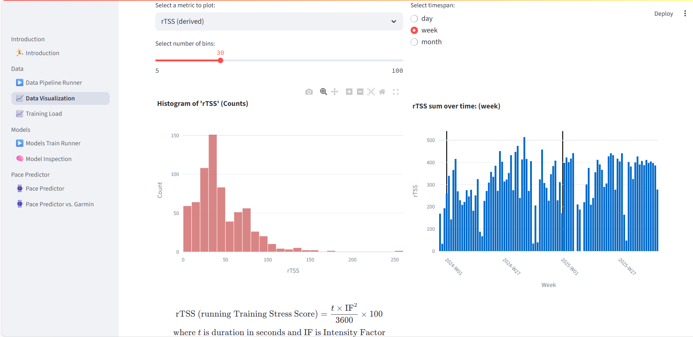
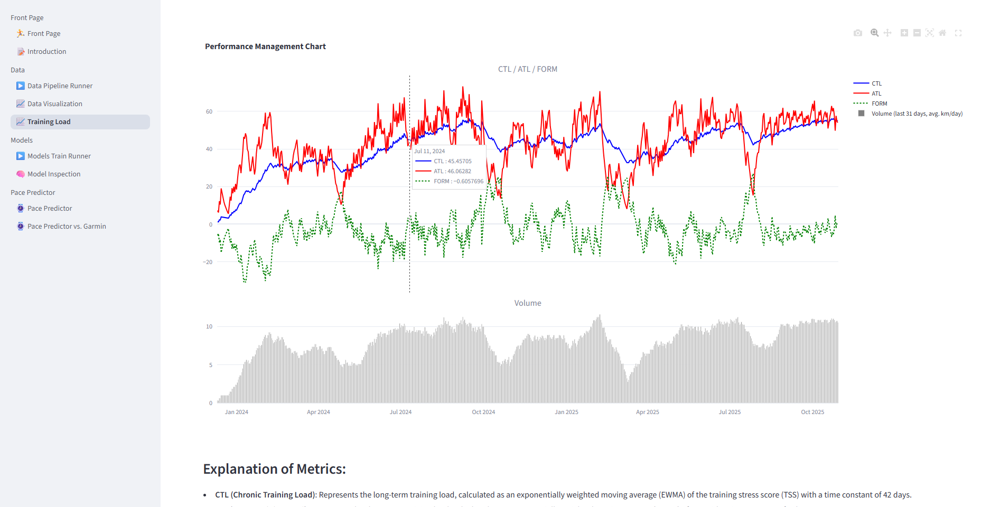
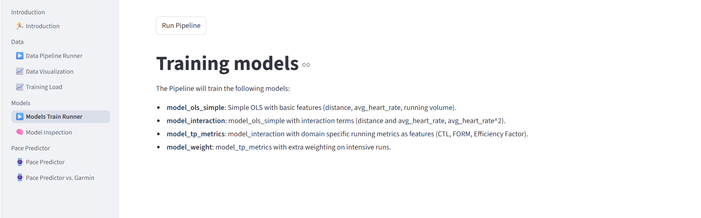
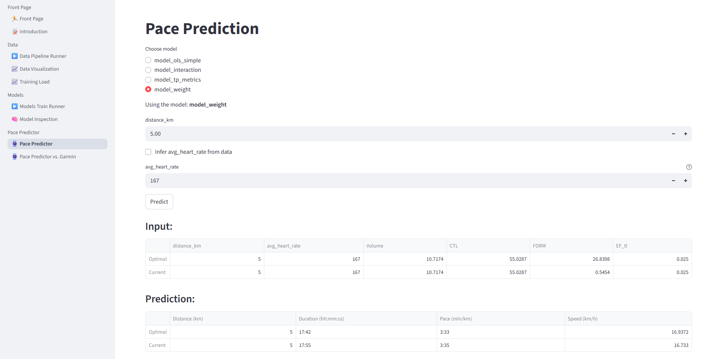

# Pace-Predictor
A Streamlit-based app for analyzing Garmin running data and predicting race pace using personalized models.

## Table of Contents

- [Overview](#overview)
- [Installation](#installation)
- [Configuration](#configuration)
- [How to use](#how-to-use)
- [Examples](#examples)
- [License](#license)

## Overview

### How it works
1. Extracts Garmin activity data via Garmin Connect.
2. Processes and stores the data locally for easy analysis.
3. Runs exploratory analysis and visualizations through Streamlit.
4. Trains regression models to predict pace for various distances and intensities.

Project Status: 🚧 In development — working prototype with functioning data pipeline and visualization modules.

### Key Objectives
- Act as a database for my Garmin activity data, so I can easily access the data for analysis, visualization and modelling.
- Try to create a more accurate and granular Pace Predictor compared to the the Garmin Pace Predictor
- Provide pace predictions for any distance from 800m up to the Marathon
- Implement more advanced features in the future (fx route-specific predictions, factoring in features like elevation and terrain)
---

## Installation

1. **Clone the repository:**
   ```bash
   git clone https://github.com/FrederikVK/Pace-Predictor.git
   cd Pace-Predictor
   ```

2. **Set up the Conda environment:**
   ```bash
   bash setup_env.sh
   ```
   Requires a conda installation.

   This will create and activate a new Conda environment named `pace-predictor-env` with all required dependencies installed.

## Configuration (Optional)
If you want to extract your own personal running data, you can pass credentials with:

Setup an .env file with:
```
GARMIN_EMAIL=your_mail_here
GARMIN_PASSWORD=your_pwd_here
```

## How to use
Spin up streamlit app

```streamlit run app.py```

## Examples

### Run data pipeline and see summary statistics of the data


### Interactive visualization of different variables


### Visualize training load metrics


### Train simple Linear Regression models


### Inspect the trained models


### Predict pace for given intensity (heart rate) and distance using one of the trained models


### Compare the trained models with Garmin Pace Predictor


## License
Distributed under the MIT License.
See LICENSE for more information.
